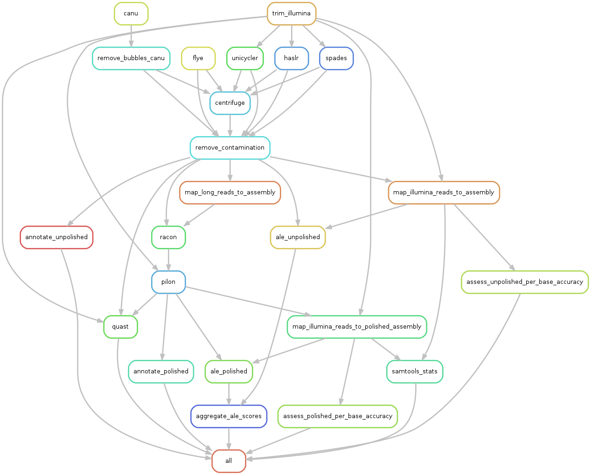

## Pipeline overview



## Prerequisites
To run the whole pipeline you will need the following programs installed:
-   [Singularity (v3)][singularity]
-   [Conda][conda]
-   [Snakemake][snakemake]
-   [ripgrep][ripgrep]

### Decontamination
During the workflow, contamination is removed using a combination of [centrifuge][centrifuge] 
and a custom script, [`remove_contamination.py`][remove_contamination]. This pipeline assumes that a centrifuge 
database already exists. If you don't have one then you can build/download one by following 
the instructions [here][centrifuge_db].  
The centrifuge database I use internally for this was built on 28/07/2019 as part of a 
pipeline for [another project][puntseq]. The code used to generate this database can be 
found [here][puntseq_centrifuge].

In `remove_contamination.py`, a requested parameter is `--taxtree`. I have provided one 
of these files in [`resources/taxonomy/mtbc.taxonlist`][taxonlist] for the 
*Mycobacterium tuberculosis* Complex ([NCBI:txid77643][mtbc]). To create your own taxtree 
you will either need to create a file with a taxon ID you class as *not* contamination on each line, or 
generate one using [`taxonkit`][taxonkit]. For example, to create the MTBC one, I ran the 
following command:

```bash
mtbc_taxid=77643
taxonkit list --show-name --show-rank --ids "$mtbc_taxid" > mtbc.taxonlist
```

For more information about this command, refer to the [documentation][taxonkit_list].

## Setup

## Data

## Run


[singularity]: https://sylabs.io/guides/3.5/user-guide/quick_start.html#quick-installation-steps
[conda]: https://docs.conda.io/projects/conda/en/latest/user-guide/install/
[snakemake]: https://snakemake.readthedocs.io/en/stable/
[ripgrep]: https://github.com/BurntSushi/ripgrep
[centrifuge]: https://github.com/DaehwanKimLab/centrifuge
[remove_contamination]: https://github.com/mbhall88/head_to_head_pipeline/blob/master/analysis/assembly/scripts/remove_contamination.py
[centrifuge_db]: https://ccb.jhu.edu/software/centrifuge/manual.shtml#database-download-and-index-building
[puntseq]: https://github.com/d-j-k/puntseq
[puntseq_centrifuge]: https://github.com/d-j-k/puntseq/blob/d9c28007c2a9af123e1644d136bf43f225b3e463/analysis/rules/centrifuge.smk#L1-L74
[taxonlist]: https://github.com/mbhall88/head_to_head_pipeline/blob/master/analysis/assembly/resources/taxonomy/mtbc.taxonlist
[mtbc]: https://www.ncbi.nlm.nih.gov/Taxonomy/Browser/wwwtax.cgi?mode=Info&id=77643&lvl=3&lin=f&keep=1&srchmode=1&unlock
[taxonkit]: https://github.com/shenwei356/taxonkit/
[taxonkit_list]: https://bioinf.shenwei.me/taxonkit/usage/#list
