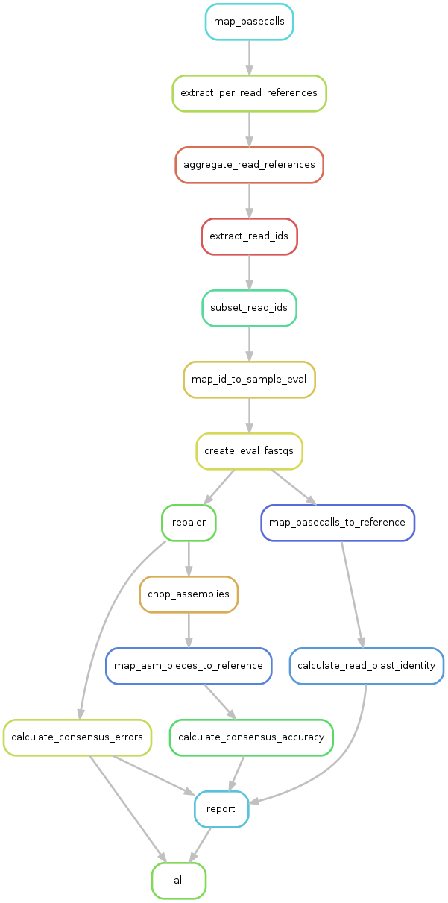
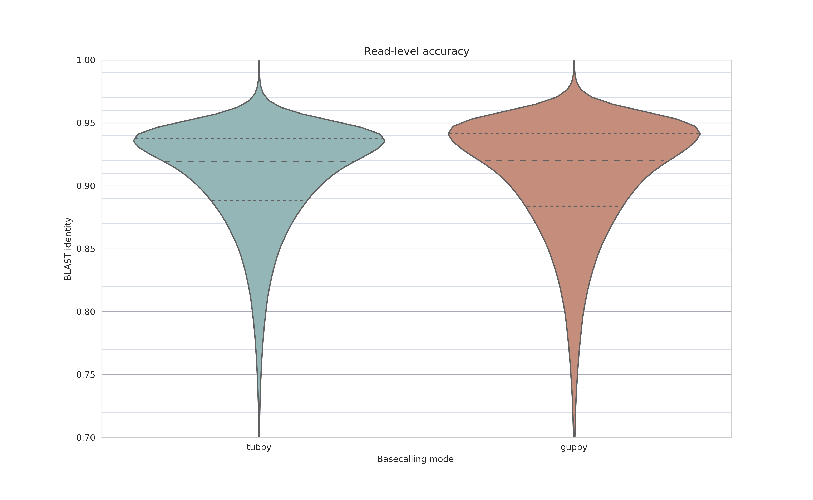
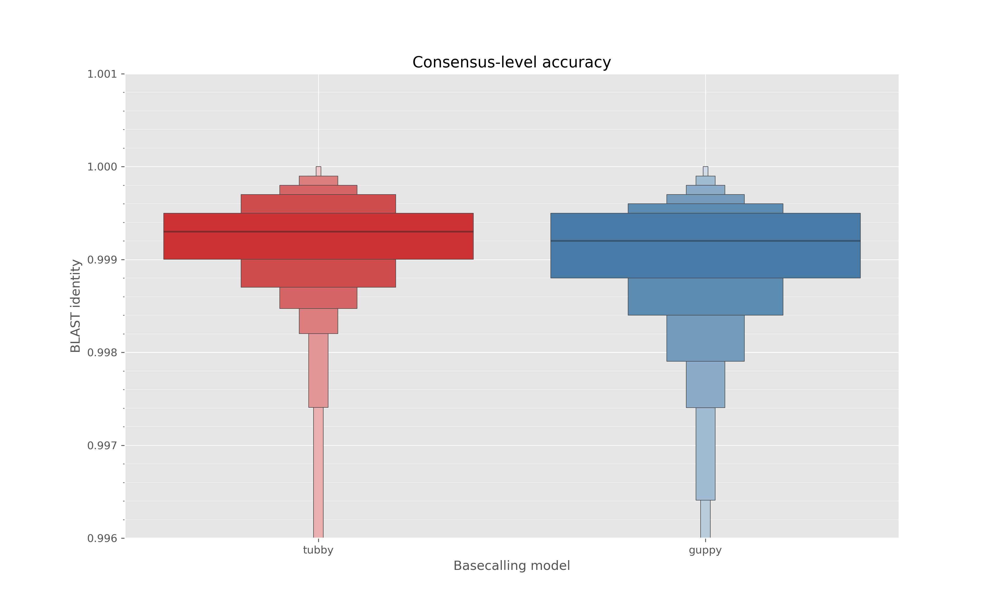
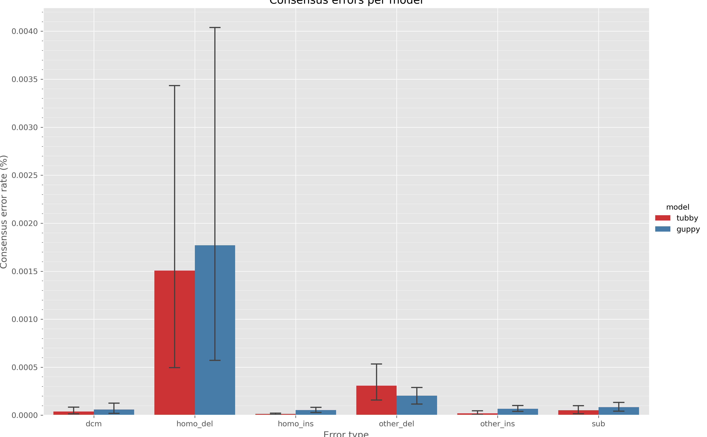

Scripts and workflows for training a *M. tuberculosis* species-specific nanopore
basecalling model.

[TOC]: #

# Table of Contents
- [Prerequisites](#prerequisites)
- [Setup](#setup)
- [Usage](#usage)
- [Method](#method)
- [Results](#results)
  - [Read identity](#read-identity)
  - [Relative read length](#relative-read-length)
  - [Consensus accuracy](#consensus-accuracy)
  - [Consensus error types](#consensus-error-types)
- [Conclusion](#conclusion)


## Prerequisites

To run the whole pipeline you will need the following programs installed:
- [Singularity (v3)][singularity]
- [Conda][conda]
- [Snakemake][snakemake]
- [ripgrep][ripgrep]

## Setup

Recursively clone the repository

```sh
# git version >=2.13
git clone --recursive-submodules https://github.com/mbhall88/head_to_head_pipeline.git
# git version <=2.13
git clone --recursive https://github.com/mbhall88/head_to_head_pipeline.git

cd head_to_head_pipeline/analysis/basecall_training 
```

If you cloned this repository with `git`, without also cloning the submodules, you will
additionally need to fetch the files for the submodules this workflow relies on.

```sh
git submodule update --init --recursive
```

## Usage

When submitting on an LSF cluster you may wish to use the provided submission script
[`scripts/submit_lsf.sh`](scripts/submit_lsf.sh). This script assumes you are using the
[snakemake LSF profile][lsf-profile].

Additionally, the provided `lsf.yaml` configuration file sets out the LSF parameters to
use for submitting the model training rule to a multi-GPU cluster. Note that the host
(`m`) option may differ on your cluster. If using GPUs ensure you pass
`--singularity-args '--nv'` to `snakemake` to tell Singularity to use the local GPU
resources.

An example of how I submit this pipeline on my LSF cluster is

```sh
bash scripts/submit_lsf.sh --singularity-args "--nv"
```

Depending on the size of the data, this pipeline may take a week or two to run.

## Method

An overview of the workflow is below



The bulk of the training-related rules are explained in further detail in the [taiyaki
walkthrough][walkthrough].

The additional steps for evaluating the pipeline involve mapping the reads that were set
aside for evaluation to the truth assemblies and then calculating the accuracy metrices
for this. See the report notebook (below) for more information about these steps.

Versions for software used can be found in [`config.yaml`](config.yaml).

## Results

All of the code, with inline plots, can be found at [`report/processed-report.ipynb`](report/processed-report.ipynb). Or alternatively, in a nice rendered format [here][nbviewer].

### Read identity



The read identity we use here is [BLAST identity][blast]. We align the reads to their truth assembly and BLAST identity is effectively the number of matching bases in an alignment, divided by the total length of the alignment.

In the above plot we can see that tubby (the bizarre name for our Mtb model) has a slightly lower median identity that the default guppy model.

| model   |       count |     mean |       std |      min |      25% |      50% |      75% |   max |
|:--------|------------:|---------:|----------:|---------:|---------:|---------:|---------:|------:|
| guppy   | 1.04726e+06 | 0.906706 | 0.047993  | 0.418569 | 0.883851 | 0.920139 | 0.94159  |     1 |
| tubby   | 1.04551e+06 | 0.907458 | 0.0427165 | 0.46884  | 0.888199 | 0.91944  | 0.937628 |     1 |

### Relative read length


We define relative read length as the length of the *aligned* part of the read, divided by the total length of the read. The purpose of this metric is to see whether there is a bias towards insertions (greater than 1.0) or deletions (less than 1.0).

The above plot shows that there is clearly a bias toward deletions in the tubby model compared to guppy.

| model   |       count |     mean |       std |      min |      25% |      50% |      75% |     max |
|:--------|------------:|---------:|----------:|---------:|---------:|---------:|---------:|--------:|
| guppy   | 1.04726e+06 | 0.991849 | 0.0239203 | 0.455827 | 0.984215 | 0.993197 | 1.00145  | 1.92775 |
| tubby   | 1.04551e+06 | 0.968501 | 0.0259952 | 0.518429 | 0.959963 | 0.974115 | 0.982883 | 1.87119 |

### Consensus accuracy



Here we show consensus accuracy in a similar manner to read identity. Each "read" in this context is a result of chopping the [`rebaler`](https://github.com/rrwick/Rebaler) assembly of the reads up into 10Kbps "chunks" to simulate reads, and then mapping those chunks back to the original assembly using `minimap2` (and the `-x asm5` preset).

We see in the above plot that the tubby model produces reads that, once assembled, do not give as accurate an assembly as with guppy.

| model   |   count |     mean |        std |      min |      25% |      50% |      75% |      max |
|:--------|--------:|---------:|-----------:|---------:|---------:|---------:|---------:|---------:|
| guppy   |    3534 | 0.998776 | 0.00442863 | 0.863168 | 0.998801 | 0.999201 | 0.9995   | 1        |
| tubby   |    3526 | 0.997348 | 0.00520924 | 0.862076 | 0.997108 | 0.997804 | 0.998402 | 0.999816 |

### Consensus error types



Here we classify the types of errors that occur in the assemblies and look at how these errors compare across models. The errors are per-assembly, so the confidence intervals represent to variation in error types between samples/assemblies.

As we might have expected give the shorter relative read length of tubby reads, there is a clear deletion systematic bias with our Mtb model compared to guppy. The only thing we do seem to (marginally) improve on compared to guppy is insertions.

## Conclusion

As it stands, guppy is better for basecalling *M. tuberculosis* samples. This TB-specific model could potentially be improved with some more tweaking of what reads are included in training or not etc. If anyone has some suggestions for how to improve this model, we would be very happy to hear :pray:.


[singularity]: https://sylabs.io/guides/3.5/user-guide/quick_start.html#quick-installation-steps
[conda]: https://docs.conda.io/projects/conda/en/latest/user-guide/install/
[snakemake]: https://snakemake.readthedocs.io/en/stable/
[ripgrep]: https://github.com/BurntSushi/ripgrep
[lsf-profile]: https://github.com/Snakemake-Profiles/snakemake-lsf
[walkthrough]: https://github.com/nanoporetech/taiyaki/blob/master/docs/walkthrough.rst
[nbviewer]: https://nbviewer.jupyter.org/github/mbhall88/head_to_head_pipeline/blob/master/analysis/basecall_training/report/processed-report.ipynb
[blast]: https://lh3.github.io/2018/11/25/on-the-definition-of-sequence-identity#blast-identity
