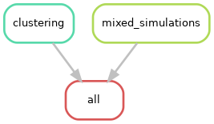

## Pipeline overview

This pipeline takes in the distance matrices from the
[baseline variant pipeline](../baseline_variants) and produces clustering figures and
metrics, as well as running the mixed simulations.

See [`report.html`](report.html) for the results.

