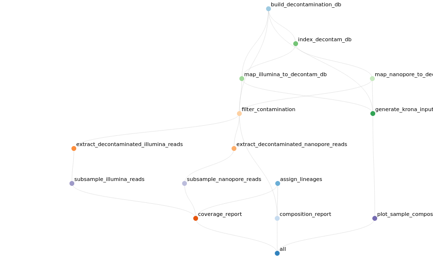

## Pipeline overview

The code in this directory is for a pipeline to perform quality control on the samples
before variant calling is done later. **There is an assumption that the [Illumina
baseline variant calling](../../analysis/baseline_variants) has been done already - as these VCFs are
used for lineage-calling.

In the end of this pipeline the FASTQ files in the `subsampled` directory are
decontaminated and contain no unmapped reads (as determined by the decontamination
database).

The resulting report with sample composition and coverage is in
[`report.html.gz`](report/report.html.gz). You will need to decompress the file before viewing
it. Something like `gzip -d -c report.html.gz > report.html` should do the trick.
